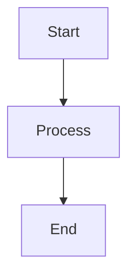

# talocode-visual-artifact

Turn structured text into clean visual artifacts.

## Purpose

Create visual artifacts from text plans, reviews, and documentation.

## When to Use

Use this skill when:
- Creating visual plans
- Building implementation reviews
- Generating release recaps
- Creating diagrams
- Building architecture maps
- Making product comparisons
- Creating one-page HTML artifacts

## Artifact Types

### Text Artifacts
- Markdown summaries
- Structured reports
- Review documents

### Visual Artifacts
- HTML cards
- Diagrams (Mermaid/ASCII)
- Flow charts
- Architecture maps

### Interactive Artifacts
- HTML pages with styling
- Interactive diagrams
- Clickable elements

## Artifact Schema

Each artifact should include:
- **Title**: Clear, descriptive
- **Summary**: One-line overview
- **Sections**: Organized content blocks
- **Visual elements**: Diagrams, charts, or styled content
- **Source**: Where the content came from
- **Export format**: How to save/use it

## Text-to-Visual Workflow

1. Extract key information from text
2. Organize into sections
3. Choose visual format
4. Generate content
5. Apply styling
6. Export artifact

## Diagram Formats

### Mermaid


### ASCII
```
+--------+     +--------+
| Start  | --> | Process |
+--------+     +--------+
                    |
                    v
               +--------+
               |   End  |
               +--------+
```

### HTML/CSS
```html
<div class="card">
  <h3>Title</h3>
  <p>Content</p>
</div>
```

## Review Checklist

- [ ] Content is accurate
- [ ] Visual is clear
- [ ] No secrets exposed
- [ ] No external tracking
- [ ] Local-first generation
- [ ] Exportable format

## Notes

- Artifacts are local-first
- No external uploads
- Keep it clean and readable
- Export as needed
